# دليل المستخدم — منصة KinJo

## الدليل التشغيلي الرسمي لتسجيل وإدارة الحضانات في المملكة الأردنية الهاشمية

> **ملاحظة حول لغة الواجهة:** المنصة تعمل بلغة واحدة في كل مرة. عند اختيار العربية تظهر جميع
> النصوص بالعربية واتجاه الصفحة من اليمين إلى اليسار، ولا تختلط اللغتان في الشاشة نفسها.
> جميع الصور في هذا الدليل مأخوذة من الواجهة العربية الفعلية.

---

## المحتويات

1. [مقدمة عن المنصة](#1-مقدمة-عن-المنصة)
2. [بيانات التواصل والدعم](#2-بيانات-التواصل-والدعم)
3. [الصفحة الرئيسية](#3-الصفحة-الرئيسية)
4. [إنشاء حساب وتسجيل الدخول](#4-إنشاء-حساب-وتسجيل-الدخول)
5. [الأدوار والصلاحيات](#5-الأدوار-والصلاحيات)
6. [دليل ولي الأمر](#6-دليل-ولي-الأمر)
7. [دليل المشرف التربوي](#7-دليل-المشرف-التربوي)
8. [دليل مدير الحضانة](#8-دليل-مدير-الحضانة)
9. [دليل مسؤول النظام والجهات الرسمية](#9-دليل-مسؤول-النظام-والجهات-الرسمية)
10. [صفحات المساعدة](#10-صفحات-المساعدة)
11. [الأمان وإمكانية الوصول](#11-الأمان-وإمكانية-الوصول)
12. [حل المشكلات الشائعة](#12-حل-المشكلات-الشائعة)

---

## 1. مقدمة عن المنصة

**KinJo** منصة رقمية موحدة لتسجيل الأطفال في الحضانات ومتابعة يومهم وإدارة العمل داخل الحضانة
والإشراف عليها. تجمع المنصة أربع فئات في نظام واحد:

* **أولياء الأمور** — تسجيل الأطفال ومتابعة الحضور والتقارير اليومية.
* **المشرفون التربويون** — تسجيل الحضور وكتابة التقارير ورصد الملاحظات.
* **مدراء الحضانات** — مراجعة الطلبات وإدارة الكادر والصفوف ومتابعة الأداء.
* **مسؤولو النظام والجهات الرسمية** — إدارة السجل الوطني والتحليلات والتقارير الرسمية.

الهدف من المنصة إنهاء العمل بالنماذج الورقية والاتصالات الهاتفية، وجعل معلومات الطفل متاحة
لولي أمره في اليوم نفسه.

---

## 2. بيانات التواصل والدعم

| البند | القيمة |
|---|---|
| **الدعم الفني المباشر** | `+962790337512` |
| **البريد الإلكتروني** | `support@kinjo.jo` |
| **أوقات العمل الرسمية** | الأحد — الخميس، 8:00 صباحاً – 3:00 مساءً |

يظهر رقم الدعم أسفل كل صفحة في المنصة وفي صفحة «تواصل معنا».

---

## 3. الصفحة الرئيسية

الصفحة الرئيسية هي نقطة البداية لأي زائر: تشرح الخدمة وتوجّه كل فئة إلى مكانها الصحيح.

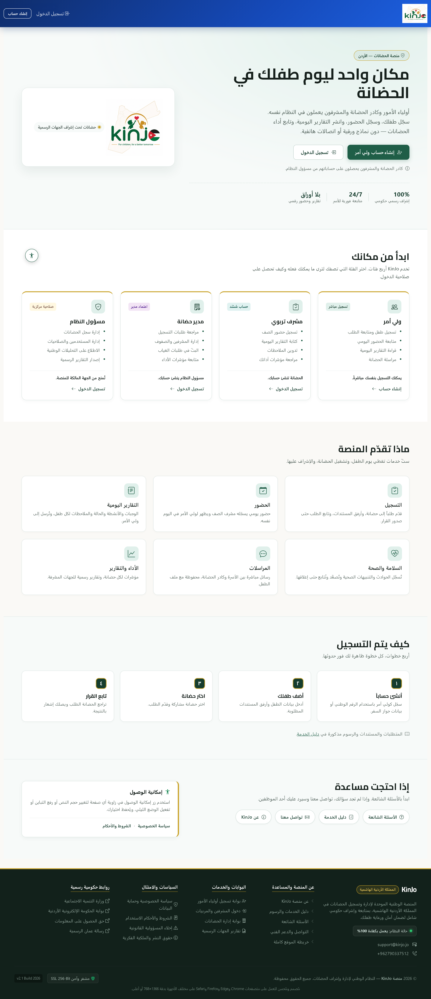

**ما الذي تراه في الصورة:**

1. **الترويسة العلوية** — شعار المنصة، وزرّا «تسجيل الدخول» و«إنشاء حساب».
2. **العنوان الرئيسي** — «مكان واحد ليوم طفلك في الحضانة» مع شرح مختصر للخدمة.
3. **شريط المؤشرات** — إشراف رسمي حكومي، متابعة فورية للأسر، وتقارير وحضور رقمي بلا أوراق.
4. **قسم «ابدأ من مكانك»** — أربع بطاقات، واحدة لكل فئة، تبيّن ما يمكنك فعله وكيف تحصل على
   صلاحية الدخول. لاحظ الشارة الملوّنة أعلى كل بطاقة: **«تسجيل مباشر»** لولي الأمر،
   و**«حساب مُنشأ»** للمشرف، و**«اعتماد مدير»** لمدير الحضانة، و**«صلاحية مركزية»** لمسؤول النظام.
5. **قسم «ماذا تقدّم المنصة»** — ست خدمات: التسجيل، الحضور، التقارير اليومية، السلامة والصحة،
   المراسلات، والأداء والتقارير.
6. **قسم «كيف يتم التسجيل»** — أربع خطوات مرقّمة بالتسلسل.
7. **التذييل** — روابط الخدمات والسياسات والبوابات الحكومية، وبيانات الدعم بما فيها رقم الهاتف.

---

## 4. إنشاء حساب وتسجيل الدخول

### 4.1 من يستطيع إنشاء حساب بنفسه؟

* **ولي الأمر فقط** ينشئ حسابه بنفسه عبر زر «إنشاء حساب».
* **المشرف التربوي ومدير الحضانة** يحصلان على الحساب من إدارة الحضانة أو من مسؤول النظام.
* **مسؤول النظام** تُمنح صلاحيته من الجهة المالكة للمنصة.

هذه التفرقة مهمة: إن كنت من كادر الحضانة فلا تبحث عن صفحة تسجيل، بل اطلب الحساب من إدارتك.

### 4.2 شاشة إنشاء الحساب

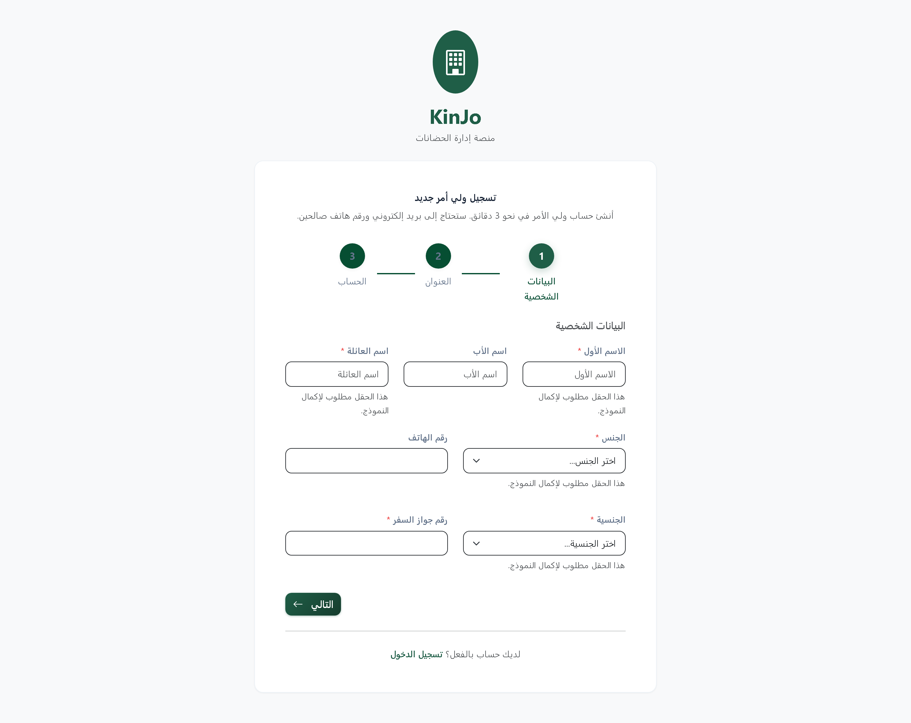

يُطلب في هذه الشاشة: الاسم، ورقم الهاتف بصيغة `07XXXXXXXX`، والبريد الإلكتروني، وكلمة المرور،
والرقم الوطني للأردنيين أو رقم جواز السفر لغير الأردنيين.

### 4.3 شاشة تسجيل الدخول

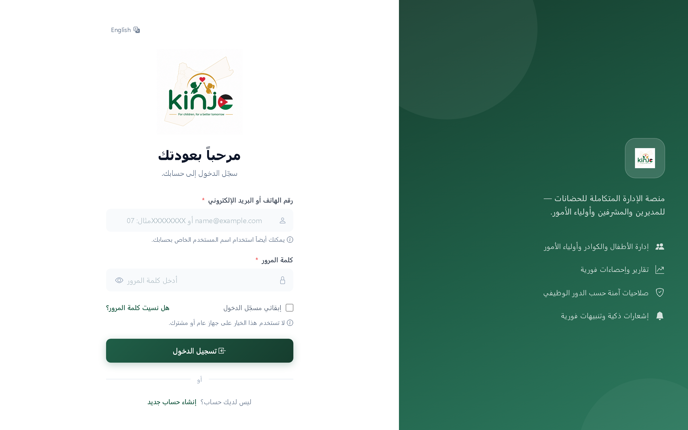

أدخل اسم المستخدم وكلمة المرور. عند نسيان كلمة المرور استخدم رابط «نسيت كلمة المرور» ليصلك
رابط إعادة التعيين على بريدك الإلكتروني.

---

## 5. الأدوار والصلاحيات

| الدور | كيف يحصل على الحساب | أين يبدأ بعد الدخول |
|---|---|---|
| ولي أمر | تسجيل ذاتي مباشر | لوحة تحكم ولي الأمر |
| مشرف تربوي | تنشئه الحضانة | لوحة تحكم المشرف |
| مدير حضانة | ينشئه مسؤول النظام | مؤشرات الأداء |
| مسؤول النظام | تمنحها الجهة المالكة | لوحة التحكم الإدارية |

كل مستخدم يرى ما يخص دوره فقط، ولا يمكنه الاطلاع على بيانات خارج نطاق صلاحيته.

---

## 6. دليل ولي الأمر

### 6.1 لوحة التحكم

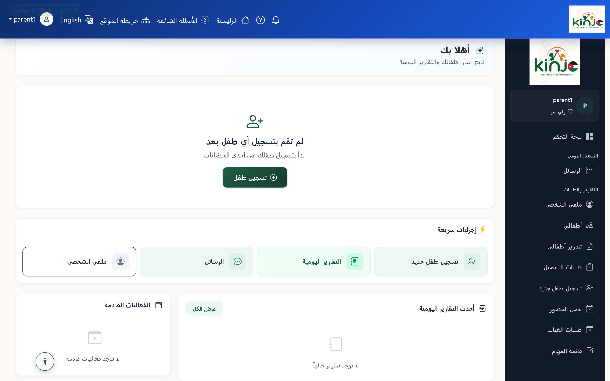

**شرح الشاشة:**

* **الترحيب في الأعلى** — «أهلاً بك» مع سطر «تابع أخبار أطفالك والتقارير اليومية».
* **القائمة الجانبية** — لوحة التحكم، الرسائل، ملفي الشخصي، أطفالي، تقارير أطفالي،
  طلبات التسجيل، تسجيل طفل جديد، سجل الحضور، طلبات الغياب، وقائمة المهام.
* **الحالة الفارغة** — إن لم تسجّل طفلاً بعد تظهر رسالة «لم تقم بتسجيل أي طفل بعد» مع زر
  **«تسجيل طفل»**. هذه ليست رسالة خطأ، بل دعوة للبدء.
* **الإجراءات السريعة** — تسجيل طفل جديد، التقارير اليومية، الرسائل، وملفي الشخصي.
* **أحدث التقارير اليومية** و**الفعاليات القادمة** — تمتلئ تلقائياً بعد قبول طفلك في حضانة.

### 6.2 أطفالي

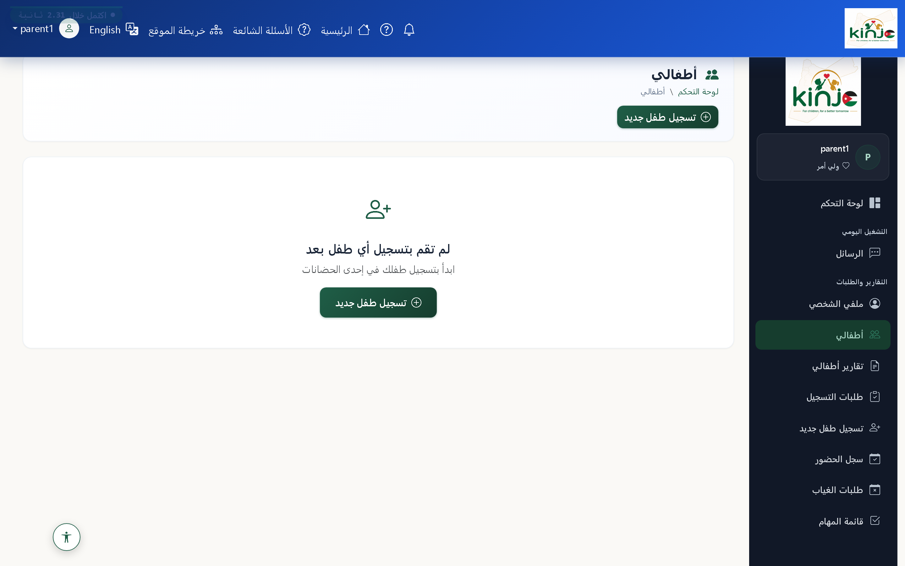

تعرض هذه الصفحة جميع الأطفال المسجّلين تحت حسابك، وحالة كل طفل، والحضانة الملتحق بها. من هنا
تضيف طفلاً جديداً أو تفتح ملف طفل قائم.

### 6.3 سجل الحضور

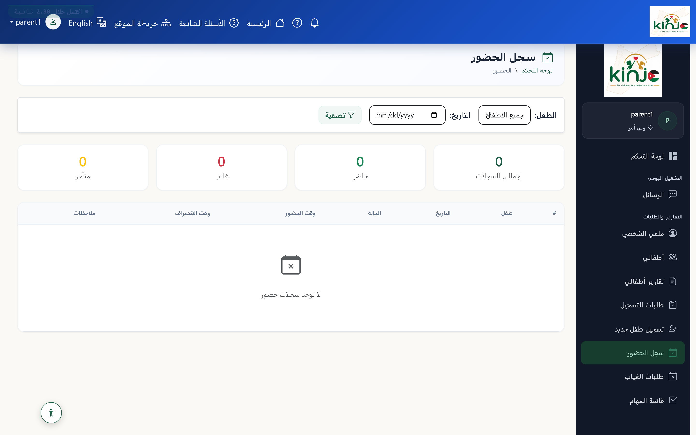

يعرض سجل الحضور اليومي لكل طفل: حاضر، أو غائب، أو غياب بعذر. يسجّل مشرف الصف الحضور خلال اليوم
فيظهر لك في اليوم نفسه دون انتظار.

### 6.4 خطوات التسجيل الأربع

| الخطوة | الإجراء |
|---|---|
| **١** | أنشئ حساباً باستخدام الرقم الوطني أو بيانات جواز السفر |
| **٢** | أضف طفلك وأدخل بياناته وأرفق المستندات المطلوبة |
| **٣** | اختر حضانة مشاركة وقدّم الطلب |
| **٤** | تابع القرار — تراجع الحضانة الطلب ويصلك إشعار بالنتيجة |

المتطلبات والمستندات والرسوم مذكورة بالتفصيل في **دليل الخدمة** (القسم 10).

---

## 7. دليل المشرف التربوي

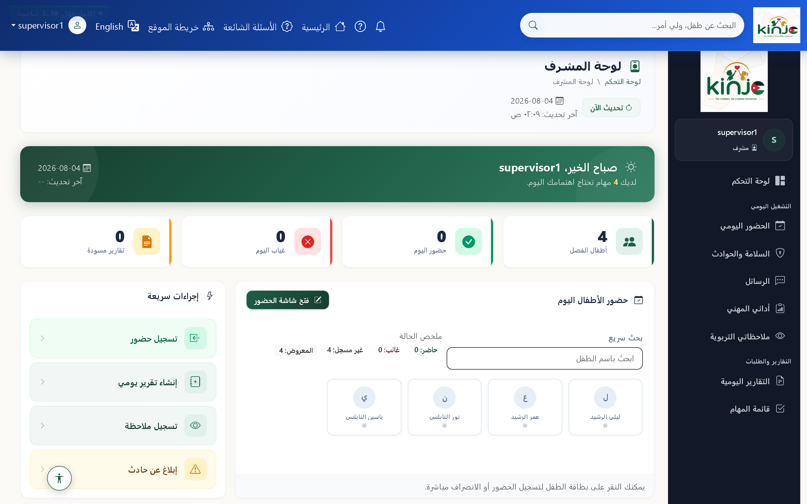

**المهام اليومية للمشرف:**

* **تسجيل الحضور والغياب** — رصد حضور أطفال الصف يومياً وتوثيق وقت الدخول والمغادرة واسم المستلم.
* **كتابة التقارير اليومية** — تقرير لكل طفل يشمل الوجبات والأنشطة والحالة المزاجية والملاحظات،
  ثم إرساله إلى إدارة الحضانة أو مباشرة إلى ولي الأمر.
* **تدوين الملاحظات** — رصد الملاحظات التربوية والتطورية على الطفل.
* **رصد الحوادث والتنبيهات الصحية** — توثيق أي حادث أو تنبيه صحي وتصعيده فوراً.
* **مراجعة مؤشرات الأداء الشخصية** — نسبة إنجاز التقارير وانتظام تسجيل الحضور.

---

## 8. دليل مدير الحضانة

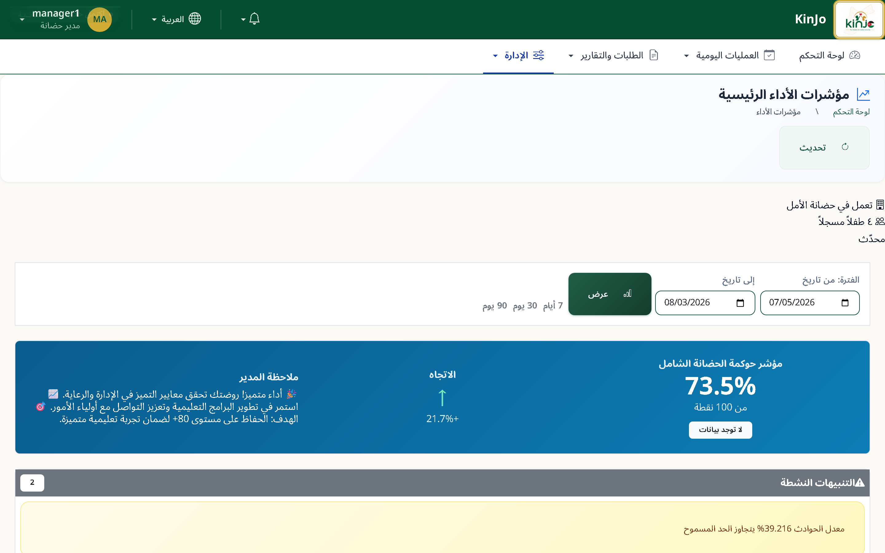

**مهام مدير الحضانة:**

* **مراجعة طلبات التسجيل** — قبول أو رفض الطلبات الجديدة وتوزيع الأطفال على الصفوف.
* **إدارة المشرفين والصفوف** — توزيع الكادر وتحديد الطاقة الاستيعابية لكل صف.
* **البتّ في طلبات الغياب** — الموافقة على طلبات الغياب المقدّمة من أولياء الأمور.
* **متابعة مؤشرات الأداء** — نسبة الحضور اليومي، والتقارير المعلّقة، ومؤشرات الجودة التشغيلية.
* **مراجعة التقارير اليومية** — اعتماد التقارير قبل إرسالها إلى الأسر.

---

## 9. دليل مسؤول النظام والجهات الرسمية

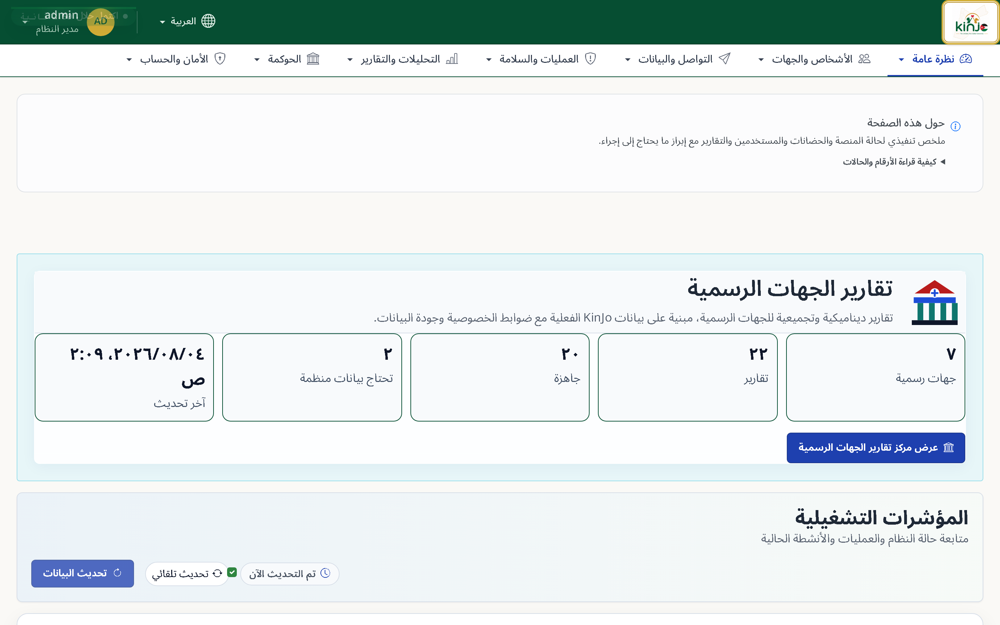

**شرح الشاشة:**

* **شريط التنقل العلوي** — نظرة عامة، الأشخاص والجهات، التواصل والبيانات، العمليات والسلامة،
  التحليلات والتقارير، الحوكمة، والأمان والحساب.
* **بطاقة «تقارير الجهات الرسمية»** — عدد الجهات الرسمية، وعدد التقارير، والجاهز منها، وما يحتاج
  بيانات منظمة، مع وقت آخر تحديث.
* **المؤشرات التشغيلية** — متابعة حالة النظام والعمليات والأنشطة الحالية، مع خيار التحديث التلقائي.

**المهام الرئيسية:**

* إدارة السجل الوطني للحضانات واعتماد الحضانات الجديدة ومتابعة تراخيصها.
* إدارة المستخدمين والصلاحيات لجميع الأدوار.
* الاطلاع على التحليلات الوطنية على مستوى المحافظات والألوية.
* إصدار وتصدير التقارير الرسمية للجهات المشرفة.
* مراجعة سجلات التدقيق لكل عملية تغيير في النظام.

---

## 10. صفحات المساعدة

### 10.1 دليل الخدمة

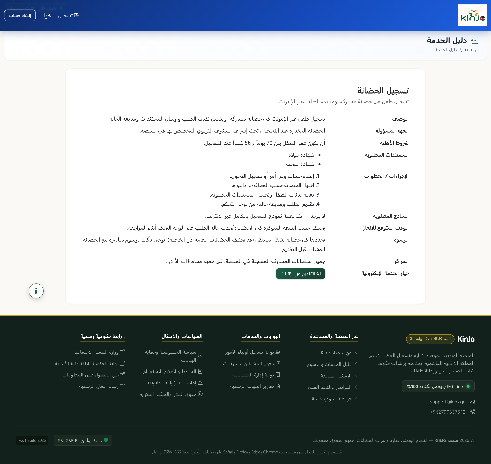

يشرح دليل الخدمة تفاصيل خدمة تسجيل الحضانة: الوصف، والجهة المسؤولة، وشروط الأهلية المتعلقة بعمر
الطفل، والمستندات المطلوبة، والرسوم، ومدة الإنجاز.

### 10.2 الأسئلة الشائعة

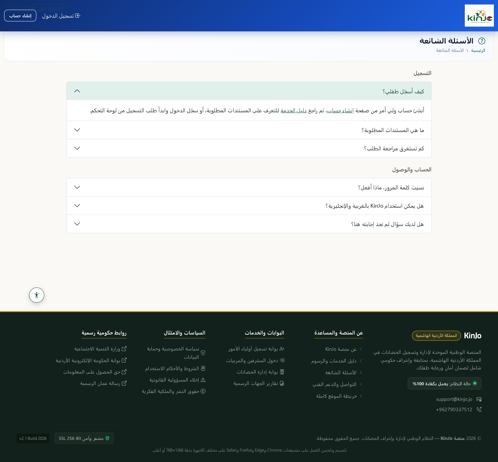

يجيب هذا القسم عن الأسئلة الأكثر تكراراً حول التسجيل والحسابات والتقارير والخصوصية.

### 10.3 تواصل معنا

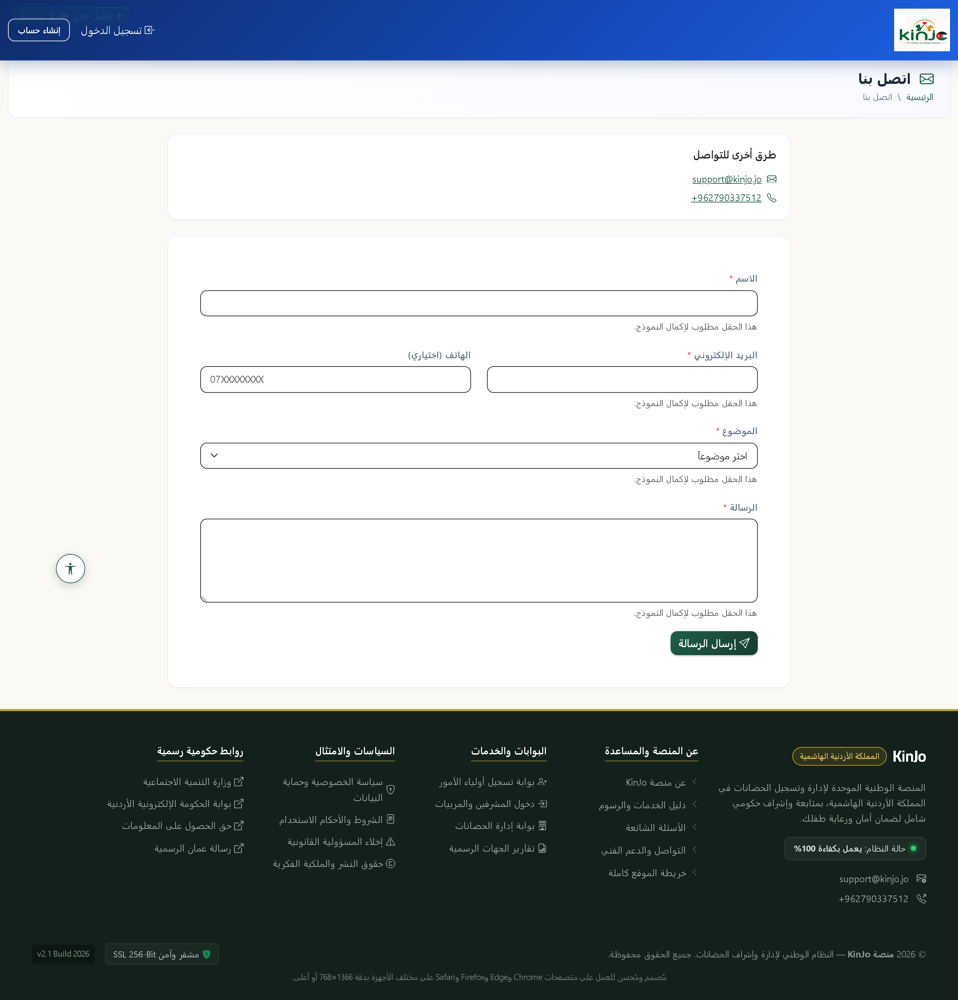

تعرض الصفحة رقم الدعم `+962790337512` والبريد الإلكتروني، إضافة إلى نموذج لإرسال استفسار مباشر.

---

## 11. الأمان وإمكانية الوصول

### 11.1 الأمان والخصوصية

* جميع البيانات الشخصية للطفل وحسابات الأسر منقولة عبر اتصال مشفّر.
* كل مستخدم مقيّد بصلاحيات دوره، ولا يمكنه الوصول إلى بيانات خارج نطاقه.
* تُسجَّل كل عملية تغيير في سجلات تدقيق يمكن للجهات المشرفة مراجعتها.

### 11.2 إمكانية الوصول

يوجد **زر إمكانية الوصول** في زاوية كل صفحة، ويتيح:

* **تكبير أو تصغير حجم النص** لمن يجد صعوبة في القراءة.
* **رفع التباين** لتوضيح النصوص والألوان.
* **الوضع الليلي** لتقليل إجهاد العين.
* **إعادة الضبط** للعودة إلى الإعدادات الافتراضية.

يُحفظ اختيارك تلقائياً ويبقى فعّالاً في زياراتك اللاحقة. كما تدعم المنصة التنقل بلوحة المفاتيح
مع إطار واضح حول العنصر المحدد، وتحترم إعداد «تقليل الحركة» في نظام التشغيل.

### 11.3 دعم اللغة العربية

الواجهة مصممة أصلاً للعربية باتجاه من اليمين إلى اليسار، بخط **Cairo** للعناوين. عند اختيار
العربية لا تظهر أي نصوص إنجليزية في الشاشة، والعكس صحيح.

---

## 12. حل المشكلات الشائعة

| المشكلة | الحل |
|---|---|
| نسيت كلمة المرور | استخدم رابط «نسيت كلمة المرور» في شاشة الدخول؛ يصلك رابط إعادة التعيين على بريدك. |
| لا أجد صفحة تسجيل لكادر الحضانة | حسابات الكادر تُنشأ من إدارة الحضانة أو مسؤول النظام، ولا يوجد تسجيل ذاتي لها. |
| لوحة التحكم تقول «لم تقم بتسجيل أي طفل بعد» | حالة طبيعية للحساب الجديد. اضغط **«تسجيل طفل»** للبدء. |
| لا تظهر تقارير يومية | تبدأ التقارير بالظهور بعد قبول طلب التسجيل وبدء دوام الطفل فعلياً. |
| الصفحة تظهر بلغة غير مفضّلة | استخدم مبدّل اللغة في الترويسة العلوية؛ تتغيّر اللغة واتجاه الصفحة معاً. |
| مشكلة لم تُذكر هنا | تواصل مع الدعم على `+962790337512` أو عبر صفحة «تواصل معنا». |

---

## ملحق: مصدر الصور

جميع الصور في هذا الدليل مأخوذة من نسخة تشغيل فعلية للمنصة بالواجهة العربية، بدقة عرض
1440×900 ومعامل وضوح مضاعف. ملفات الصور في المجلد `docs/handbook-img/`:

| الملف | الشاشة |
|---|---|
| `01-home.png` | الصفحة الرئيسية |
| `02-login.png` | تسجيل الدخول |
| `03-register.png` | إنشاء حساب |
| `04-service-guide.png` | دليل الخدمة |
| `05-faq.png` | الأسئلة الشائعة |
| `06-contact.png` | تواصل معنا |
| `07-parent-dashboard.png` | لوحة تحكم ولي الأمر |
| `08-parent-children.png` | أطفالي |
| `09-parent-attendance.png` | سجل الحضور |
| `10-supervisor-dashboard.png` | لوحة تحكم المشرف |
| `11-manager-kpi.png` | مؤشرات مدير الحضانة |
| `12-admin-dashboard.png` | لوحة التحكم الإدارية |
